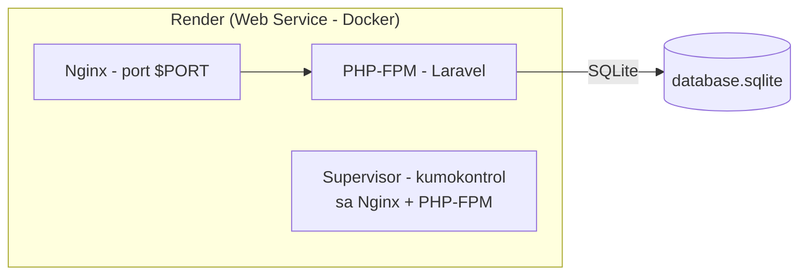

# 📦 Deploying Smart-Stock to Render (Step-by-Step Guide)

> **Taglish guide** — English (technical terms) + Filipino (explanations).
> Sundan lang ang sequence na ito mula itaas hanggang ibaba.

---

## 🧠 Paano gumagana ang setup na ito? (Bago mag-deploy)



Ginagamit natin ang **3 layers** sa loob ng isang container:

| Layer | Trabaho | File |
|---|---|---|
| **Nginx** | Web server — tumatanggap ng HTTP, nagse-serve ng static files, nag-proxy ng `.php` papunta sa FPM | [`docker/nginx/default.conf.template`](docker/nginx/default.conf.template) |
| **PHP-FPM** | Nagpapatakbo ng Laravel PHP code | [`docker/php/www.conf`](docker/php/www.conf) |
| **Supervisor** | Process manager — parehong pinapatakbo ang Nginx + PHP-FPM sa iisang container | [`docker/supervisor/supervisord.conf`](docker/supervisor/supervisord.conf) |

### Bakit kailangan ang 3 layers?
- Ang **Docker** ay nagpapatakbo lang ng **ISANG** main process.
- Kailangan natin ng **2** (nginx para sa HTTP, php-fpm para sa PHP).
- Kaya si **Supervisor** ang main process — siya ang nag-aasikaso sa dalawa.

> **💡 Database:** Ginagamit natin ang **SQLite** (`database/database.sqlite`). Walang external database na kailangan.

---

## 📂 Ang mga file na ginawa ko (at ang trabaho nila)

```
Smart-Stock/
├── Dockerfile                        ← Multi-stage build (composer → node → production)
├── .dockerignore                     ← Mga file na hindi isasama sa image (importante: .env!)
├── render.yaml                       ← Blueprint para sa one-click deploy (optional pero nice!)
├── docker/
│   ├── entrypoint.sh                 ← Nagha-handle ng $PORT, APP_KEY, caches, storage perms
│   ├── nginx/
│   │   └── default.conf.template     ← Nginx config (nakikinig sa $PORT)
│   ├── php/
│   │   └── www.conf                  ← PHP-FPM pool (clear_env=no = nakikita ang env vars)
│   └── supervisor/
│       └── supervisord.conf          ← Pinapatakbo ang nginx + php-fpm
└── DEPLOYMENT.md                     ← Ito! (ang guide na ito)
```

### Paano gumagana ang Dockerfile (multi-stage)?

1. **Stage 1 — `composer:2`**: In-install ang PHP dependencies (`vendor/`) — mas mabilis at mas konting space kaysa sa pag-install sa final image.
2. **Stage 2 — `node:20-alpine`**: Ini-compile ang Vite + Tailwind assets (`public/build/`).
3. **Stage 3 — `php:8.3-fpm`**: Ang **pinaka-final image** na may nginx, php-fpm, supervisor, at ang SAME code — pero wala nang composer/node hugot (maliit lang ang image!).

> **💡 Key insight:** Ang `.env` file mo ay **HINDI** kasama sa image (nasa [`.dockerignore`](.dockerignore)). Kaya lahat ng secrets ay dapat ilagay bilang **Environment Variables** sa Render dashboard.

---

## ✅ STEP 1 — I-commit ang code sa GitHub

```bash
git status                  # tingnan ang mga changes
git add .
git commit -m "Add Docker setup (nginx + php-fpm + supervisor)"
git remote add origin https://github.com/YOUR-USERNAME/YOUR-REPO.git
git push -u origin main
```

---

## ✅ STEP 2 — Deploy sa Render (Web Service)

1. Mag-login sa [render.com](https://render.com)
2. Click **New +** → **Web Service**
3. **Connect** ang GitHub repo mo
4. Awtomatikong **madetect ng Render ang `Dockerfile`** — ito ang gagamitin para i-build ang image

### 🖥️ Sa Web Service settings:

| Field | Value | Bakit kailangan |
|---|---|---|
| Name | `smart-stock` | Pangalan ng service |
| Region | `Singapore` | Malapit sa Pilipinas |
| Branch | `main` | Git branch |
| Environment | `Docker` | Auto-detect |
| Instance Type | `Free` o anumang tier | |

### 🔐 Environment Variables (ito ang pinaka-importante!)

| Variable | Value | Bakit kailangan |
|---|---|---|
| `APP_KEY` | *(ang key mula sa iyong `.env`)* | Encryption sa sessions/cookies. Generate: `php artisan key:generate --show` |
| `APP_ENV` | `production` | Production mode |
| `APP_DEBUG` | `false` | Huwag i-expose ang stack traces |
| `SESSION_DRIVER` | `file` | Walang Redis |
| `CACHE_STORE` | `file` | Walang Redis |
| `QUEUE_CONNECTION` | `null` | Walang queue worker |
| `DB_CONNECTION` | `sqlite` | SQLite database |
| `DB_DATABASE` | `/app/database/database.sqlite` | Location ng SQLite file |

> **💡 Kailangan bang i-set ang lahat?** Actually — ang `SESSION_DRIVER`, `CACHE_STORE`, `QUEUE_CONNECTION`, at `LOG_CHANNEL` ay **may default na sa [Dockerfile](Dockerfile)**! Kailangan mong i-set manually: **`APP_KEY`** at **`DB_DATABASE`** (kung hindi, magko-create ng bagong APP_KEY sa bawat deploy at mawawala ang sessions).

---

## 🧯 Troubleshooting (karaniwang problema sa Render)

| Symptom | Cause | Fix |
|---|---|---|
| **`No application encryption key has been specified`** | Walang `APP_KEY` env var | I-set ang `APP_KEY` sa Render env vars |
| **`Connection refused` / 502** | Hindi naka-listen sa `$PORT` | Automatic na sa entrypoint — i-check ang logs |
| **`Permission denied` sa database.sqlite** | Walang write access sa SQLite file | Siguraduhing may `chmod` sa `database/` folder |

> **⚠️ Tandaan:** Dahil naka-`sync: false` ang `APP_KEY` sa [render.yaml](render.yaml), kailangan mong **i-set pa rin ito manually** sa dashboard pagkatapos ng Blueprint deploy (para hindi ma-leak ang secret sa public repo).

---

## 📊 Data Persistence

Ang data mo ay nasa **SQLite file** (`database/database.sqlite`). Sa Render, ang filesystem ay **ephemeral** — ibig sabihin, **mawawala ang data kapag i-restart ang service**.

Para sa persistent data, mag-consider ng:
- **Render Disk** (paid) — i-attach ang SQLite file sa persistent disk
- **External database** (PostgreSQL/MySQL) — palitan ang SQLite sa production
