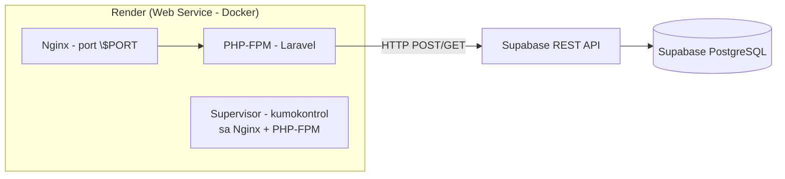

# 📦 Deploying Laravel + Supabase to Render (Step-by-Step Guide)

> **Taglish guide** — English (technical terms) + Filipino (explanations).  
> Sundan lang ang sequence na ito mula itaas hanggang ibaba.

---

## 🧠 Paano gumagana ang setup na ito? (Bago mag-deploy)



Ginagamit natin ang **3 layers** sa loob ng isang container:

| Layer | Trabaho | File |
|---|---|---|
| **Nginx** | Web server — tumatanggap ng HTTP, nagse-serve ng static files, nag-proxy ng `.php` papunta sa FPM | [`docker/nginx/default.conf.template`](docker/nginx/default.conf.template) |
| **PHP-FPM** | Nagpapatakbo ng Laravel PHP code | [`docker/php/www.conf`](docker/php/www.conf) |
| **Supervisor** | Process manager — parehong pinapatakbo ang Nginx + PHP-FPM sa iisang container | [`docker/supervisor/supervisord.conf`](docker/supervisor/supervisord.conf) |

### Bakit kailangan ang 3 layers?
- Ang **Docker** ay nagpapatakbo lang ng **ISANG** main process.
- Kailangan natin ng **2** (nginx para sa HTTP, php-fpm para sa PHP).
- Kaya si **Supervisor** ang main process — siya ang nag-aasikaso sa dalawa.

---

## 📂 Ang mga file na ginawa ko (at ang trabaho nila)

```
supabasetest/
├── Dockerfile                        ← Multi-stage build (composer → node → production)
├── .dockerignore                     ← Mga file na hindi isasama sa image (importante: .env!)
├── render.yaml                       ← Blueprint para sa one-click deploy (optional pero nice!)
├── docker/
│   ├── entrypoint.sh                 ← Nagha-handle ng $PORT, APP_KEY, caches, storage perms
│   ├── nginx/
│   │   └── default.conf.template     ← Nginx config (nakikinig sa $PORT)
│   ├── php/
│   │   └── www.conf                  ← PHP-FPM pool (clear_env=no = nakikita ang env vars)
│   └── supervisor/
│       └── supervisord.conf          ← Pinapatakbo ang nginx + php-fpm
└── DEPLOYMENT.md                     ← Ito! (ang guide na ito)
```

### Paano gumagana ang Dockerfile (multi-stage)?

1. **Stage 1 — `composer:2`**: In-install ang PHP dependencies (`vendor/`) — mas mabilis at mas konting space kaysa sa pag-install sa final image.
2. **Stage 2 — `node:20-alpine`**: Ini-compile ang Vite + Tailwind assets (`public/build/`).
3. **Stage 3 — `php:8.3-fpm`**: Ang **pinaka-final image** na may nginx, php-fpm, supervisor, at ang SAME code — pero wala nang composer/node hugot (maliit lang ang image!).

> **💡 Key insight:** Ang `.env` file mo ay **HINDI** kasama sa image (nasa [`.dockerignore`](.dockerignore:17)). Kaya lahat ng secrets ay dapat ilagay bilang **Environment Variables** sa Render dashboard.

---

## ✅ STEP 1 — Supabase (kung wala ka pang table)

1. Pumunta sa [supabase.com](https://supabase.com) → **New Project**
2. Sa **Table Editor**, gumawa ng table na **`inputs`**:
   - `id` (int8, primary, auto-increment)
   - `created_at` (timestamptz, default `now()`)
   - `first_name` (text), `last_name` (text), `age` (int4), `address` (text)
3. **⚠️ RLS Policies (ito ang lagi kina-calimutan!)** — kasi gumagamit tayo ng **anon key**:
   - Table Editor → `inputs` table → i-toggle ang **RLS enabled**
   - Add policy → **Enable insert for everyone** (para makapag-save ang form)
   - Add policy → **Enable read for everyone** (para makita ang list sa `/info`)
   - > Kung hindi ito gagawin, makakakuha ka ng **401/403 error** sa deployment!
4. Kunin ang credentials sa **Settings → API**:
   - `Project URL` — hal. `https://xxxxxxxx.supabase.co`
   - `anon` / `publishable` key

---

## ✅ STEP 2 — I-commit ang code sa GitHub

```bash
git status                  # tingnan ang mga changes
git add .
git commit -m "Add Docker setup (nginx + php-fpm + supervisor)"
git remote add origin https://github.com/YOUR-USERNAME/YOUR-REPO.git
git push -u origin main
```

---

## ✅ STEP 3 — Deploy sa Render (Web Service)

1. Mag-login sa [render.com](https://render.com)
2. Click **New +** → **Web Service**
3. **Connect** ang GitHub repo mo
4. Awtomatikong **madetect ng Render ang `Dockerfile`** — ito ang gagamitin para i-build ang image

### 🖥️ Sa Web Service settings:

| Field | Value |
|---|---|
| Name | `laravel-supabase-app` |
| Region | `Singapore` (malapit sa Pilipinas) |
| Branch | `main` |
| Environment | `Docker` (auto-detect) |
| Instance Type | `Free` o anumang tier |

### 🔐 Environment Variables (ito ang pinaka-importante!)

| Variable | Value | Bakit kailangan |
|---|---|---|
| `APP_KEY` | *(ang key mula sa iyong `.env`)* | Encryption sa sessions/cookies. Generate: `php artisan key:generate --show` |
| `APP_ENV` | `production` | Production mode |
| `APP_DEBUG` | `false` | Huwag i-expose ang stack traces |
| `SUPABASE_URL` | `https://xxxxxxxx.supabase.co` | URL ng Supabase mo |
| `SUPABASE_ANON_KEY` | `sb_publishable_...` | Ang anon key mo |
| `SESSION_DRIVER` | `file` | Wala tayong local DB |
| `CACHE_STORE` | `file` | Wala tayong Redis |
| `QUEUE_CONNECTION` | `null` | Wala tayong queue workers |
| `LOG_CHANNEL` | `stderr` | Para makita ang logs sa Render |

> **💡 Kailangan bang i-set ang lahat?** Actually — ang `SESSION_DRIVER`, `CACHE_STORE`, `QUEUE_CONNECTION`, at `LOG_CHANNEL` ay **may default na sa [Dockerfile](Dockerfile:118)**! Kailangan mong i-set manually: **`APP_KEY`**, **`SUPABASE_URL`**, at **`SUPABASE_ANON_KEY`** (kung hindi, magko-create ng bagong APP_KEY sa bawat deploy at mawawala ang sessions).

5. Click **Deploy Web Service** 🚀

---

## 🎯 STEP 4 — Pagkatapos mag-deploy

- Ang web service mo ay may URL na `https://<name>.onrender.com`
- **`/`** → ang inputs form
- **`/info`** → ang listahan ng mga na-submit

### Pagka-deploy, i-verify:
```bash
curl -I https://<name>.onrender.com/
# Dapat may HTTP/2 200 na response
```

---

## 🧯 Troubleshooting (karaniwang problema sa Render + Supabase)

| Sintomas | Dahilan | Solusyon |
|---|---|---|
| **`No application encryption key has been specified`** | Walang `APP_KEY` env var | I-set ang `APP_KEY` sa Render env vars |
| **`401 Unauthorized` sa Supabase** | Hindi naka-set ang RLS policy | I-enable ang **insert/select policies** sa `inputs` table |
| **`Connection refused` / 502** | Hindi naka-listen sa `$PORT` | Automatic na sa entrypoint — i-check ang logs |
| **`403 Forbidden` sa static files** | Mali ang permissions | Automatic na — i-check na `STORAGE_PATH` ay naka-set |
| **Blank page / 500** | Config cache na luma | Sa Render → **Deploy** → **Clear build cache & deploy** |
| **Sessions nawawala kada restart** | `APP_KEY` binabago | I-set ang fixed `APP_KEY` sa env vars |

### Saan makikita ang logs?
Render Dashboard → iyong Web Service → **Logs** tab. Ilalabas doon ang lahat ng output ng `nginx` at `php-fpm` kasi naka-set sila sa `/dev/stdout` at `/dev/stderr`.

---

## 🔄 Optional: Auto-deploy sa tuwing mag-push ka sa `main`

- Naka-**`autoDeploy: true`** na ito sa [render.yaml](render.yaml:25)
- Sa Render dashboard, i-check na naka-ON ang **Auto-Deploy** sa iyong Web Service settings

---

## 🗂️ Optional: Deploy gamit ang Blueprint (render.yaml)

Kung gusto mong i-auto-configure ang buong setup (kasama ang env vars) mula sa code:

1. I-commit at i-push ang `render.yaml`
2. Sa Render → **New +** → **Blueprint**
3. Connect ang repo — awtomatikong magpo-provision ang Web Service

> **⚠️ Tandaan:** Dahil naka-`sync: false` ang `SUPABASE_URL`, `SUPABASE_ANON_KEY`, at `APP_KEY` sa [render.yaml](render.yaml:47), kailangan mong **i-set pa rin sila manually** sa dashboard pagkatapos ng Blueprint deploy (para hindi ma-leak ang secrets sa public repo).

---

## 🏁 Done!

Kapag green ang deploy status at nag-load ang `/` at `/info`, **success na ang deployment mo** 🎉

Ang data mo ay ligtas sa **Supabase PostgreSQL** (cloud database) — hindi sa Render — kaya kahit i-restart ang Render, hindi mawawala ang mga na-submit na inputs.