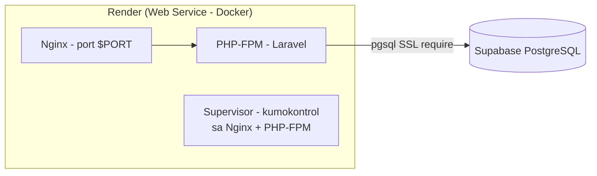

# Deploying Smart-Stock to Render + Supabase PostgreSQL (Step-by-Step Guide)

> **Taglish guide** — English (technical terms) + Filipino (explanations).
> Sundan lang ang sequence na ito mula itaas hanggang ibaba.

---

## Paano gumagana ang setup na ito? (Bago mag-deploy)


```mermaid
flowchart LR
    subgraph "Render (Web Service - Docker)"
        N[Nginx - port $PORT] --> F[PHP-FPM - Laravel]
        S[Supervisor - kumokontrol<br/>sa Nginx + PHP-FPM]
    end
    F -->|pgsql SSL require| DB[(Supabase PostgreSQL)]
```

Ginagamit natin ang **3 layers** sa loob ng isang container:

| Layer | Trabaho | File |
|---|---|---|
| **Nginx** | Web server — tumatanggap ng HTTP, nagse-serve ng static files, nag-proxy ng `.php` papunta sa FPM | [`docker/nginx/default.conf.template`](docker/nginx/default.conf.template) |
| **PHP-FPM** | Nagpapatakbo ng Laravel PHP code (may `pdo_pgsql`) | [`docker/php/www.conf`](docker/php/www.conf) |
| **Supervisor** | Process manager — parehong pinapatakbo ang Nginx + PHP-FPM sa iisang container | [`docker/supervisor/supervisord.conf`](docker/supervisor/supervisord.conf) |

> **Database:** Supabase PostgreSQL only (`DB_CONNECTION=pgsql`). Walang SQLite file sa local o prod. Ang SQLite config sa [`config/database.php`](config/database.php) ay testing only (`phpunit.xml` memory).

---

## Ang mga file na ginawa ko (at ang trabaho nila)

```
Smart-Stock/
├── Dockerfile                        ← Multi-stage build (composer → node → production, may pdo_pgsql)
├── .dockerignore                     ← Mga file na hindi isasama sa image (importante: .env!)
├── render.yaml                       ← Blueprint para sa one-click deploy (Supabase vars, sync false sa secrets)
├── docker/
│   ├── entrypoint.sh                 ← Nagha-handle ng $PORT, APP_KEY, Supabase check, caches
│   ├── nginx/
│   │   └── default.conf.template     ← Nginx config (nakikinig sa $PORT)
│   ├── php/
│   │   └── www.conf                  ← PHP-FPM pool (clear_env=no = nakikita ang env vars)
│   └── supervisor/
│       └── supervisord.conf          ← Pinapatakbo ang nginx + php-fpm
├── .env.example                      ← Template ng Supabase pgsql vars (walang password na naka-commit)
└── DEPLOYMENT.md                     ← Ito! (ang guide na ito)
```

### Paano gumagana ang Dockerfile (multi-stage)?

1. **Stage 1 — `composer:2`**: In-install ang PHP dependencies (`vendor/`).
2. **Stage 2 — `node:20-alpine`**: Ini-compile ang Vite + Tailwind assets (`public/build/`).
3. **Stage 3 — `php:8.3-fpm`**: Final image na may nginx, php-fpm + `pdo_pgsql`, supervisor.

> **Key insight:** Ang `.env` file mo ay **HINDI** kasama sa image (nasa [`.dockerignore`](.dockerignore)). Kaya lahat ng Supabase secrets ay dapat ilagay bilang **Environment Variables** sa Render dashboard.

---

## Supabase credentials na kailangan (hindi URL + anon key)

Maling akala ang `SUPABASE_URL + ANON_KEY` — pang-JS client lang yun. Ang kailangan ng Laravel ay Postgres wire vars, tugma sa [`pgsql`](config/database.php:35) block.

Supabase Dashboard > Project Settings > Database > Connect button > piliin ang URI tab. Huwag i-type ng mano-mano — i-copy paste ang host/port/user.

| Mode | `DB_HOST` | `DB_PORT` | `DB_USERNAME` | Gamit |
|---|---|---|---|---|
| Direct | `db.xxxxx.supabase.co` | `5432` | `postgres` | Migrate kung IPv6-ready ang network mo |
| Session pooler | `aws-0-ap-southeast-1.pooler.supabase.com` (kopyahin ang exact sa modal) | `5432` | `postgres.xxxxx` | Migrate sa Globe IPv4 + prod fallback |
| Transaction pooler | `aws-0-ap-southeast-1.pooler.supabase.com` | `6543` | `postgres.xxxxx` | Prod runtime sa Render only, hindi pang-migrate |

| Variable | Saan kukunin |
|---|---|
| `DB_CONNECTION=pgsql` | Fixed |
| `DB_DATABASE` | `postgres` (default) |
| `DB_PASSWORD` | Database password na ginawa mo (i-reset kung nakalimutan) |
| `DB_SSLMODE=require` | Fixed, lagi require sa Supabase |

Local template nasa [`.env.example`](.env.example). Prod template nasa [`render.yaml`](render.yaml) na may `sync: false` sa `DB_HOST` at `DB_PASSWORD` (secret, hindi naka-commit).

---

## STEP 1 — I-connect ang local `.env` sa Supabase (mula scratch)

1. Supabase Dashboard > piliin ang project mo > pindutin ang Connect button sa taas.
2. Piliin ang Transaction Pooler / Session Pooler > URI tab.
3. Kopyahin ang host, port, user — huwag i-type ng mano-mano.
4. Sa Globe IPv4 (katulad ng `nslookup` mo na IPv6-only ang Direct), gamitin ang Session pooler pang-migrate:
   `DB_HOST=aws-0-ap-southeast-1.pooler.supabase.com`, `DB_PORT=5432`, `DB_USERNAME=postgres.xxxxx`
5. Ilagay ang totoong `DB_PASSWORD` sa [`.env`](.env:37), siguraduhing walang `DB_URL` na naka-set (nag-o-override ito sa host/port/user).
6. Run `php artisan config:clear`, tapos `php artisan migrate --force`.
7. Check sa Supabase Dashboard > Table Editor kung may `users, products, sales` na.

---

## STEP 2 — I-commit ang code sa GitHub

```bash
git status
git add .
git commit -m "Switch to Supabase PostgreSQL only (no SQLite)"
git push origin main
```

---

## STEP 3 — Deploy sa Render (Web Service)

1. Mag-login sa [render.com](https://render.com)
2. Click **New +** → **Web Service**
3. **Connect** ang GitHub repo mo
4. Auto-detect ang `Dockerfile`

### Sa Web Service settings:

| Field | Value |
|---|---|
| Name | `smart-stock` |
| Region | `Singapore` |
| Branch | `main` |
| Environment | `Docker` |
| Instance Type | `Free` o anumang tier |

### Environment Variables (pinaka-importante!)

| Variable | Value | Bakit |
|---|---|---|
| `APP_KEY` | *(mula sa `php artisan key:generate --show`)* | Encryption |
| `APP_ENV` | `production` | Prod mode |
| `APP_DEBUG` | `false` | No stack trace |
| `SESSION_DRIVER` | `file` | Walang Redis |
| `CACHE_STORE` | `file` | Walang Redis |
| `QUEUE_CONNECTION` | `sync` | Hindi `null`/`database` — pag `null` o `database` na walang jobs table, nag-500 ang GET /login |
| `DB_CONNECTION` | `pgsql` | Supabase |
| `DB_HOST` | pooler host mula sa Connect modal | Supabase host |
| `DB_PORT` | `6543` sa prod (Transaction pooler) | Direct vs pooler |
| `DB_DATABASE` | `postgres` | DB name |
| `DB_USERNAME` | `postgres.xxxxx` sa pooler | DB user |
| `DB_PASSWORD` | *(secret, sync false)* | DB password |
| `DB_SSLMODE` | `require` | SSL |

> Kailangan mong i-set manually: **`APP_KEY`, `DB_HOST`, `DB_PASSWORD`**. Ang iba ay may default na sa [`Dockerfile`](Dockerfile) at [`render.yaml`](render.yaml).

---

## Troubleshooting

| Symptom | Cause | Fix |
|---|---|---|
| **`could not find driver: pgsql`** | Walang `pdo_pgsql` | Naayos na sa Dockerfile (`pdo_pgsql + libpq-dev`). Rebuild image. Local XAMPP: enable `extension=pdo_pgsql` sa `php.ini`. |
| **`No application encryption key`** | Walang `APP_KEY` | I-set sa Render env vars |
| **`Connection refused` / 502** | Hindi naka-listen sa `$PORT` | Auto sa entrypoint, check logs |
| **`password authentication failed`** | Maling `DB_PASSWORD` o user | I-reset sa Supabase Database Settings, update sa Render |
| **`connection timed out`** | Maling `DB_HOST` o port | Gamitin ang URI sa Supabase Settings > Database |
| **`(ENOTFOUND) tenant/user postgres.xxxxx not found`** | Maling host/user combo o paused project, o Transaction pooler (6543) ang ginamit pang-migrate | Kopyahin ulit ang exact host/port/user sa Connect modal. Pang-migrate: Session pooler (5432) o Direct (5432), hindi 6543. I-unpause ang project kung paused. Burahin ang `DB_URL` kung naka-set. |
| **`Unknown host / could not translate host db.xxxxx.supabase.co`** | Direct host ay IPv6-only, Globe IPv4 hindi maka-resolve | Gamitin ang Session pooler host (IPv4-ready) pang-local, hindi Direct |

> Dahil naka-`sync: false` ang `APP_KEY`, `DB_HOST`, `DB_PASSWORD` sa [render.yaml](render.yaml), i-set pa rin sila manually sa dashboard pagkatapos ng Blueprint deploy.

---

## Data Persistence

Ang data mo ay nasa **Supabase PostgreSQL**, hindi sa Render filesystem. Kahit mag-restart ang Render service, hindi mawawala ang data. Ang backup ay JSON dump sa `storage/app/private/backups` via `backup:run` (SS-39), downloadable sa Admin Backups page.
